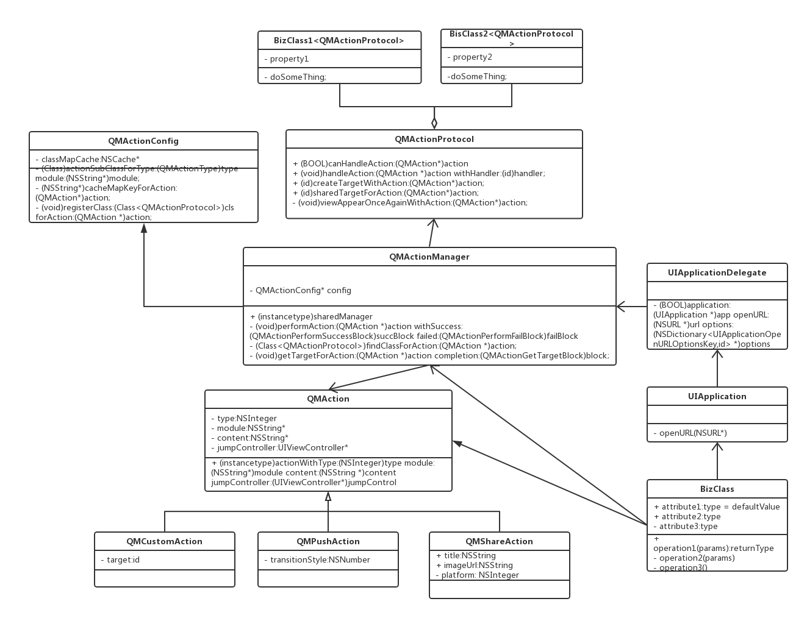

QMAction
=========
一种schema 路由的解决方案。利用runtime机制充分解耦，使得业务模块之间几乎没有依赖。

调用方式
=======
调用url schema 
---------------
    NSString *actionUrl = @"beehome://device?type=0&content=%7b%22categoryId%22%3a5%2c%22deviceId%22%3a%22000c9b8e74010000000054c415b9c1a4%22%7d";
    [[UIApplication sharedApplication] openURL:[NSURL URLWithString:actionUrl]];

注：url的content参数用json形式包装，且做了UTF-8 encode，避免特殊字符影响解析。

调用QMAction，参数从url中获取
------------------------
    QMAction *action = [QMAction actionFromUrl:@"beehome://device? type=0&content=%7b%22categoryId%22%3a5%2c%22deviceId%22%3a%22000c9b8e74010000000054c415b9c1a4%22%7d"];
    [[QMActionManager sharedManager] performAction:action];

调用QMAction，参数从字典或content字符串中获取
-----
    QMAction *action = [QMAction actionWithType:0 module:ACTION_MODULE_DEVICE contentDict:@{@"categoryId":@(5),@"deviceId":@"22000c9b8e74010000000054c415b9c1a4"} jumpController:self.navigationController];
    [[QMActionManager sharedManager] performAction:action];
    
    QMAction *action = [QMAction actionWithType:0 module:ACTION_MODULE_DEVICE content:@"%7b%22categoryId%22%3a5%2c%22deviceId%22%3a%22000c9b8e74010000000054c415b9c1a4%22%7d" jumpController:self.navigationController];
    [[QMActionManager sharedManager] performAction:action];

调用QMAction， 执行带有成功和失败的回调block的方法
---------
    QMAction *action = [QMAction actionFromUrl:url.absoluteString jumpController:jumpController];
      if ([[QMActionManager sharedManager] findClassForAction:action]) {
         [[QMActionManager sharedManager] performAction:action withSuccess:^(id target) {
           if (target) {
             QMAction *nextAction = [QMAction actionFromUrl:action.succUrl jumpController:jumpController];
             if (nextAction) {
               [[QMActionManager sharedManager] performAction:nextAction];
             }
           }
        } failed:^(QMActionErrorCode errorCode) {
          SHLogInfo(kLogModuleCommon,@"error:%d, url:%@",(long)errorCode,url.absoluteString);
      }];
     return YES;
    }

注：失败回调包括找不到class、action参数不正确、业务类定义的失败等。由调用方根据errorCode自行处理。


## 业务类需实现以下协议方法

```
+(BOOL)canHandleAction:(QMAction *)action {
    //检查type是否正确
    if (action.type == QMActionTypeDeviceCategoryCamera) {
      return YES;
    }
    return NO;
}
 

+ (BOOL)handleAction:(QMAction *)action withHandler:(id)handler {
    if (action.type == QMActionTypeDeviceCategoryCamera) {
        BizClass *vc = handler;
		//这里做业务逻辑
        return YES;
    }
    return NO;
}

+ (BOOL)shouldCreateTargetWithAction:(QMAction *)action {
	//是否需要创建实例，默认是YES
    return NO;
}

+ (id)createTargetWithAction:(QMAction *)action {
	//这里创建实例
    if (action.type == QMActionTypeDeviceCategoryCamera) {
        BizVC *vc = [[BizVC alloc] init];
        return vc;
    }
    return nil;
}
```


1. canHandle方法是必须实现的（在V1.0后可以不实现该方法，但需要提前动态注册，推荐实现），程序启动时会遍历所有实现类，找出其中遵循了QMActionProtocol的类，保存到actionClasses数组中，然后通过type对应的key(目前规则是module_type)，去缓存字典中查找对应的class。如果没有找到，就会对actionClasses中的类挨个调用canHandle方法去找到对应的class，找到的class会缓存下来，如果没找到，则中止流程，返回错误。

2. shouldCreateTargetWithAction和createTargetWithAction 是成对的方法，当shouldCreateTargetWithAction返回YES的时候，必须要实现createTargetWithAction，否则就会报错。                         

​        createTargetWithAction用于创建对应的实例，初始化需要的参数可以通过action.userInfo传入。QMPushAction类应当实现此方法。

3. -(BOOL)handleAction:(QMAction *)action withHandler:(id)handler 是可选方法。用于在页面实例创建后，做一些必要的处理工作，也是实现业务代码最主要的方法。


## QMAction架构


